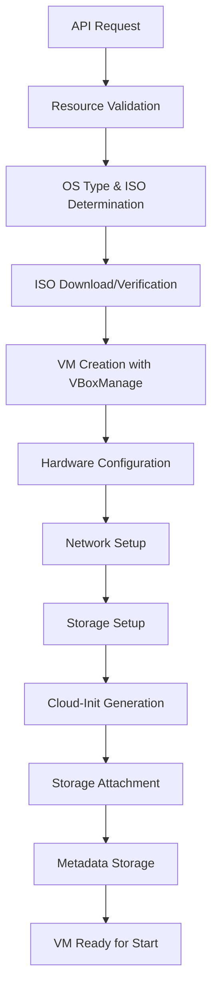
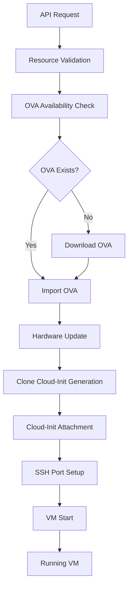

# VirtualBox Package - Comprehensive Documentation

## Table of Contents

- [Overview](#overview)
- [Architecture](#architecture)
- [File Structure](#file-structure)
- [Core Components](#core-components)
- [Resource Validation System](#resource-validation-system)
- [Storage Manager](#storage-manager)
- [Hardware Detection System](#hardware-detection-system)
- [OVA Management](#ova-management)
- [Cloud-Init Template System](#cloud-init-template-system)
- [VM Creation Flows](#vm-creation-flows)
- [API Reference](#api-reference)
- [Directory Structure](#directory-structure)
- [Best Practices](#best-practices)

## Overview

The `virtualbox` package provides a comprehensive, production-ready interface for managing VirtualBox virtual machines (VMs) programmatically. It's designed as a high-level service layer that abstracts VirtualBox complexity while providing enterprise-grade features including:

- **Dual VM Creation Modes**: Traditional ISO-based installation and fast OVA-based cloning
- **Dynamic Hardware Detection**: Automatic host hardware analysis for optimal VM configuration
- **Resource Validation**: Comprehensive system resource checking and allocation management
- **Cloud-Init Integration**: Automated VM provisioning with user credentials and configuration
- **Storage Management**: ISO downloading, caching, and OVA template management
- **Metadata Persistence**: VM state and configuration storage using IPFS datastore
- **SSH Integration**: Automatic port forwarding setup for VM access

## Architecture

```
┌─────────────────┐    ┌─────────────────┐    ┌─────────────────┐
│   HTTP API      │    │   RPC API       │    │   Internal API  │
│ (REST endpoints)│    │ (JSON-RPC)      │    │ (Go interface)  │
└─────────┬───────┘    └─────────┬───────┘    └─────────┬───────┘
          │                      │                      │
          └──────────────────────┼──────────────────────┘
                                 │
                    ┌─────────────▼─────────────┐
                    │     VirtualBox Service    │
                    │   (service.go)            │
                    └─────────────┬─────────────┘
                                  │
          ┌───────────────────────┼───────────────────────┐
          │                       │                       │
┌─────────▼─────────┐    ┌─────────▼─────────┐    ┌─────────▼─────────┐
│  Storage Manager  │    │  VBoxManage       │    │  Hardware         │
│  (storage.go)     │    │  Executor         │    │  Detector         │
│                   │    │  (vbox_manage.go) │    │  (hardware_       │
│ - ISO Management  │    │                   │    │   detector.go)    │
│ - File Operations │    │ - VM Operations   │    │                   │
│ - OS Type Logic   │    │ - Cloud-Init      │    │ - CPU Detection   │
└───────────────────┘    │ - Storage Setup   │    │ - Memory Info     │
                         └───────────────────┘    │ - GPU Detection   │
                                                  └───────────────────┘
```

## File Structure

```
core/virtualbox/
├── README.md                           # This comprehensive documentation
├── interfaces.go                       # Service and StorageManager interfaces
├── service.go                          # Main service implementation (ServiceImpl)
├── vbox_manage.go                     # VBoxManage CLI wrapper (VBoxManageExecutor)
├── storage.go                         # File and ISO management (StorageManagerImpl)
├── hardware_detector.go               # System hardware detection and analysis
├── ova_manage.go                      # OVA file management and download functions
├── service_test.go                    # Comprehensive service tests
├── storage_test.go                    # Storage manager tests
├── hardware_detector_test.go          # Hardware detection tests
├── types/
│   └── types.go                       # Core data structures and types
├── templates/
│   ├── README.md                      # Cloud-init template documentation
│   ├── template.go                    # Template processing engine
│   ├── cloud-init-user-data-template-vm.tmpl      # Full OS install user-data
│   ├── cloud-init-meta-data-template-vm.tmpl      # Full OS install meta-data
│   ├── cloud-init-user-data-clone-vm.tmpl         # Clone VM user-data
│   └── cloud-init-meta-data-clone-vm.tmpl         # Clone VM meta-data
└── script/
    └── download_ovas.go               # OVA pre-download utility script
```

## Core Components

### 1. Service Layer (`service.go`)

The `ServiceImpl` is the main orchestrator that:

- Implements the `Service` interface
- Manages VM lifecycle operations
- Coordinates between storage, hardware detection, and VBoxManage
- Handles resource validation and system checks
- Manages metadata persistence in IPFS datastore
- Provides thread-safe operations with mutex locks

**Key Features:**

- Resource validation before VM creation
- Hardware compatibility checking
- Automatic cleanup on operation failures
- SSH port forwarding setup
- Cloud-init ISO generation and attachment

### 2. VBoxManage Executor (`vbox_manage.go`)

The `VBoxManageExecutor` provides a type-safe wrapper around VirtualBox CLI:

- Executes all VBoxManage commands
- Handles VM creation, configuration, and control
- Manages storage attachment (disks, ISOs, cloud-init)
- Provides hardware-aware configuration
- Supports both template and clone VM scenarios

**Key Operations:**

- VM creation and registration
- Hardware configuration (CPU, memory, chipset, firmware)
- Storage setup (VirtioSCSI controller, disk attachment)
- Network configuration (NAT with port forwarding)
- Cloud-init file generation and ISO creation

### 3. Storage Manager (`storage.go`)

The `StorageManagerImpl` handles all file operations:

- ISO downloading with progress reporting
- File existence checking and metadata extraction
- OS type determination based on hardware
- Checksum calculation for integrity verification
- Directory management for ISOs and OVAs

**Supported OS Types:**

- Ubuntu (64-bit, ARM64, generic)
- Debian (64-bit, ARM64, generic)
- Architecture-specific automatic selection

### 4. Hardware Detector (`hardware_detector.go`)

The `HardwareDetector` provides intelligent hardware analysis:

- CPU detection (count, architecture, model)
- Memory analysis (total, available)
- GPU detection (macOS, Linux, Windows)
- Platform-specific optimizations (Apple Silicon, Intel, etc.)
- VirtualBox settings generation based on hardware

**Hardware-Specific Configurations:**

- Chipset selection (ICH9 vs ARMv8Virtual)
- Firmware choice (EFI vs BIOS)
- Graphics controller (vmsvga vs vboxsvga)
- IOAPIC enablement based on architecture
- USB controller selection (xHCI, EHCI, OHCI)

## Resource Validation System

The resource validation system ensures system stability and prevents overcommitment:

### 1. Multi-Level Validation

```go
func (s *ServiceImpl) validateResources(ctx context.Context, req vbtypes.VMCreateRequest) error {
    // 1. System resource detection
    resourceInfo, err := resource.GetResource()

    // 2. Existing VM resource calculation
    runningVMs := s.calculateRunningVMResources(ctx)

    // 3. Resource requirement validation
    return s.validateResourceRequirements(req, resourceInfo, runningVMs)
}
```

### 2. Resource Categories

- **CPU Validation**: Prevents oversubscription beyond physical cores
- **Memory Validation**: Ensures sufficient RAM with 20% system buffer
- **Disk Validation**: Checks available storage with 10% overhead buffer
- **Overcommit Protection**: Considers only actually running VMs

### 3. Validation Thresholds

- CPU: Maximum 100% of physical cores (with warnings at 80%)
- Memory: Maximum 80% of total RAM (with system buffer)
- Disk: Maximum 90% of available storage (with overhead buffer)

## Storage Manager

The storage management system provides robust file operations:

### 1. ISO Management

```go
type StorageManager interface {
    DownloadFile(ctx context.Context, url, destPath string) error
    GetFileInfo(filePath string) (*vbtypes.ISOInfo, error)
    ListFiles(dirPath string) ([]string, error)
    FileExists(filePath string) bool
    CalculateChecksum(filePath string) (string, error)
}
```

### 2. OS Type Determination

The storage manager automatically determines appropriate OS types:

- **Hardware-Based**: Uses hardware detection for optimal compatibility
- **Architecture-Based**: Falls back to runtime.GOARCH analysis
- **Request-Based**: Honors explicit OS type specifications

### 3. File Operations

- **Download Management**: HTTP client with 30-minute timeout for large ISOs
- **Integrity Checking**: SHA256 checksum calculation
- **Directory Management**: Automatic creation of required directories
- **Metadata Extraction**: File size, modification time, checksum storage

## Hardware Detection System

### 1. Multi-Platform Detection

```go
type HardwareInfo struct {
    Architecture      string  `json:"architecture"`
    OSType           string  `json:"os_type"`
    CPUCount         int     `json:"cpu_count"`
    TotalMemoryMB    int     `json:"total_memory_mb"`
    AvailableMemoryMB int    `json:"available_memory_mb"`
    GPUType          string  `json:"gpu_type"`
    GPUCount         int     `json:"gpu_count"`
    IsAppleSilicon   bool    `json:"is_apple_silicon"`
    IsIntelMac       bool    `json:"is_intel_mac"`
    IsLinux          bool    `json:"is_linux"`
    IsWindows        bool    `json:"is_windows"`
}
```

### 2. Platform-Specific Detection

- **macOS**: System Profiler integration, Apple Silicon detection
- **Linux**: /proc filesystem analysis, lscpu integration
- **Windows**: WMI queries, DirectX detection

### 3. VirtualBox Settings Generation

```go
type VirtualBoxSettings struct {
    OSType             string `json:"os_type"`
    Chipset            string `json:"chipset"`
    Firmware           string `json:"firmware"`
    GraphicsController string `json:"graphics_controller"`
    VRAMMB             int    `json:"vram_mb"`
    IOAPICEnabled      bool   `json:"ioapic_enabled"`
    USBController      string `json:"usb_controller"`
    AudioController    string `json:"audio_controller"`
}
```

## OVA Management

### 1. OVA Template System

OVA (Open Virtualization Archive) files contain pre-installed VMs for rapid deployment:

```go
var defaultOVAURLs = map[string]string{
    "Ubuntu_64":    "https://my-server.com/ovas/template_sample_Ubuntu_64.ova",
    "Ubuntu_ARM64": "https://www.sendgb.com/src/download_one.php?...",
}
```

### 2. Pre-Download Script

**Location**: `core/virtualbox/script/download_ovas.go`

**Usage**:

```bash
# Download all supported OVA templates
go run core/virtualbox/script/download_ovas.go

# Download specific OS types
go run core/virtualbox/script/download_ovas.go Ubuntu_64 Ubuntu_ARM64
```

**Features**:

- Progress reporting during download
- Automatic directory creation (`~/VirtualBox VMs/Templates/`)
- Skip existing files
- Parallel downloads support

### 3. OVA Import Process

```go
func (s *ServiceImpl) CreateAndStartVM(ctx context.Context, req vbtypes.VMCreateRequest) (*vbtypes.VM, error) {
    // 1. Check for pre-downloaded OVA
    ovaPath := "~/VirtualBox VMs/Templates/template_sample_" + req.OSType + ".ova"

    // 2. Download if missing (slow)
    if !fileExists(ovaPath) {
        downloadOVA(req.OSType, ovaPath)
    }

    // 3. Import OVA as new VM
    s.vboxExec.ImportOVA(ovaPath, req.Name)

    // 4. Customize hardware configuration
    // 5. Generate and attach cloud-init ISO
    // 6. Start VM
}
```

## Cloud-Init Template System

### 1. Template Types

The system supports two distinct cloud-init scenarios:

#### Template VM (Full OS Installation)

- **Purpose**: New VMs created from ISO with full OS installation
- **Templates**:
  - `cloud-init-user-data-template-vm.tmpl`
  - `cloud-init-meta-data-template-vm.tmpl`
- **Features**: Complete autoinstall configuration, user creation, package installation

#### Clone VM (From OVA Template)

- **Purpose**: VMs created by importing pre-installed OVA templates
- **Templates**:
  - `cloud-init-user-data-clone-vm.tmpl`
  - `cloud-init-meta-data-clone-vm.tmpl`
- **Features**: User credential setup, minimal configuration for fast boot

### 2. Template Processing

```go
type CloudInitData struct {
    InstanceID string
    Hostname   string
    Username   string
    Password   string
}

func (tm *TemplateManager) GenerateUserData(data CloudInitData) (string, error) {
    templatePath := filepath.Join(tm.templateDir, "cloud-init-user-data-template-vm.tmpl")
    return tm.processTemplate(templatePath, data)
}
```

### 3. ISO Generation Process

```bash
# Cloud-init files are generated in: ~/VirtualBox VMs/<vmName>/cloud-init/
# ISO creation command:
mkisofs -o cloud-init.iso -V cidata -r -J user-data meta-data
# Fallback:
genisoimage -output cloud-init.iso -volid cidata -joliet -rock user-data meta-data
```

## VM Creation Flows

### 1. Standard VM Creation (ISO-Based)



**Detailed Steps:**

1. **Request Validation**: Check required parameters
2. **Resource Validation**: Ensure sufficient system resources
3. **OS Compatibility**: Validate OS type against hardware
4. **ISO Management**: Download or verify ISO availability
5. **VM Creation**: Register VM with VirtualBox
6. **Hardware Configuration**: Set CPU, memory, chipset, firmware
7. **Network Setup**: Configure NAT adapter
8. **Storage Creation**: Create VDI disk, attach ISO
9. **Cloud-Init Setup**: Generate user-data, meta-data, create ISO
10. **Final Assembly**: Attach all storage components
11. **Metadata Persistence**: Store VM info in datastore

### 2. OVA-Based VM Creation (Fast Clone)



**Detailed Steps:**

1. **Request Validation**: Check required parameters
2. **Resource Validation**: Ensure sufficient system resources
3. **OVA Check**: Look for pre-downloaded OVA template
4. **OVA Download**: Download if missing (can be slow)
5. **OVA Import**: Import as new VM with custom name
6. **Hardware Update**: Adjust CPU/memory to match request
7. **Clone Cloud-Init**: Generate minimal cloud-init for credentials
8. **Cloud-Init Attachment**: Attach cloud-init ISO
9. **SSH Setup**: Configure port forwarding
10. **VM Start**: Start in headless mode
11. **Ready State**: VM running and accessible

## API Reference

### Core VM Operations

#### `CreateVM(ctx, name, cpuCores, memoryMB, diskSizeGB, osType, username, password) (*vmResult, error)`

Creates a new VM using ISO-based installation.

- **Use Case**: Custom OS installations, full control over setup
- **Time**: 15-45 minutes (depends on OS installation)
- **Storage**: ISO + VDI disk + cloud-init ISO

#### `CreateAndStartVM(ctx, name, cpuCores, memoryMB, diskSizeGB, osType, username, password) (*vmResult, error)`

Creates and starts a VM using OVA template import.

- **Use Case**: Rapid VM provisioning, testing, development
- **Time**: 2-5 minutes (if OVA pre-downloaded)
- **Storage**: OVA import + cloud-init ISO

#### `GetVMs(ctx) ([]vmResult, error)`

Lists all registered VMs with current status.

- **Data Source**: IPFS datastore + VBoxManage status refresh
- **Performance**: Optimized with caching

#### `GetVM(ctx, vmID) (*vmResult, error)`

Retrieves detailed information about a specific VM.

- **Status Refresh**: Real-time status from VBoxManage
- **SSH Port**: Extracted from NAT forwarding rules

### VM Control Operations

#### `StartVM(ctx, vmID) (*vmResult, error)`

Starts a stopped VM with automatic SSH port forwarding setup.

#### `StopVM(ctx, vmID) (*vmResult, error)`

Gracefully stops a running VM using ACPI power button.

#### `PauseVM(ctx, vmID) (*vmResult, error)`

Pauses VM execution while maintaining memory state.

#### `ResumeVM(ctx, vmID) (*vmResult, error)`

Resumes a paused VM from its previous state.

#### `ResetVM(ctx, vmID) (*vmResult, error)`

Performs hard reset (equivalent to power cycle).

### Management Operations

#### `UpdateVM(ctx, vmID, name, cpuCores, memoryMB, diskSizeGB) (*vmResult, error)`

Updates VM configuration (requires VM to be stopped).

#### `DeleteVM(ctx, vmID) error`

Completely removes VM and all associated files.

### Resource and System Information

#### `GetVMUsage(ctx, vmID) (*vmUsageResult, error)`

Retrieves resource usage statistics for a specific VM.

#### `GetAllVMUsage(ctx) (*vmUsageResult, error)`

Gets aggregate resource usage across all VMs.

#### `ListISOs(ctx) ([]isoInfoResult, error)`

Lists all available ISO files with metadata.

#### `DeleteISO(ctx, isoPath) error`

Removes an ISO file from storage.

#### `ListOSTypes(ctx) ([]string, error)`

Returns supported OS types for the current hardware.

## Directory Structure

### Runtime Directory Layout

```
~/VirtualBox VMs/
├── ISOs/                              # Downloaded ISO files
│   ├── ubuntu-24.04.2-live-server-amd64.iso
│   ├── ubuntu-24.04.2-live-server-arm64.iso
│   └── debian-12.11.0-amd64-netinst.iso
├── Templates/                         # Pre-downloaded OVA templates
│   ├── template_sample_Ubuntu_64.ova
│   └── template_sample_Ubuntu_ARM64.ova
├── <vm-name-1>/                      # Individual VM directories
│   ├── <vm-name-1>.vdi              # Virtual disk file
│   └── cloud-init/                   # Cloud-init files
│       ├── meta-data                 # Cloud-init metadata
│       ├── user-data                 # Cloud-init configuration
│       └── cloud-init.iso           # Generated cloud-init ISO
├── <vm-name-2>/
│   ├── <vm-name-2>.vdi
│   └── cloud-init/
│       ├── meta-data
│       ├── user-data
│       └── cloud-init.iso
└── ...
```

### Generated Files per VM

Each VM creates several files during its lifecycle:

- **VDI File**: Primary virtual disk (`<vmname>.vdi`)
- **Cloud-Init Directory**: Contains initialization files
- **Meta-Data**: VM instance information for cloud-init
- **User-Data**: User configuration and credentials
- **Cloud-Init ISO**: Bootable ISO containing cloud-init files

## Best Practices

### 1. Pre-Setup Requirements

```bash
# Essential: Download OVA templates before first use
go run core/virtualbox/script/download_ovas.go

# Verify VirtualBox installation
VBoxManage --version

# Ensure sufficient disk space (10GB+ per VM)
df -h ~/
```

### 2. VM Creation Strategy

- **Development/Testing**: Use `CreateAndStartVM` with OVA templates for speed
- **Production/Custom**: Use `CreateVM` with ISO for full control
- **Resource Planning**: Always validate system resources before creation

### 3. Monitoring and Maintenance

- **Resource Monitoring**: Regularly check `GetAllVMUsage` for system health
- **Storage Management**: Clean up unused ISOs and old VMs
- **Template Updates**: Periodically refresh OVA templates

### 4. Error Handling

- **Automatic Cleanup**: Failed VM creation automatically cleans up partial resources
- **Resource Validation**: Always validates before creation to prevent failures
- **Status Verification**: Check VM status after operations

### 5. Security Considerations

- **SSH Access**: VMs automatically get SSH port forwarding for management
- **User Credentials**: Cloud-init handles secure user setup
- **Network Isolation**: VMs use NAT networking by default for security

---

For implementation details and source code examination, refer to the individual files:

- `service.go`: Main service implementation
- `vbox_manage.go`: VBoxManage command execution
- `storage.go`: File and ISO management
- `hardware_detector.go`: System hardware analysis
- `templates/`: Cloud-init template system
